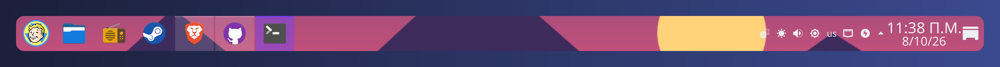

<p align="center">
  
</p>

<h1 align="center">Dock Banner</h1>

<p align="center">
  Put any image — sharp or blurred — on the native KDE Plasma panel.
</p>

<p align="center">
  <a href="LICENSE"></a>
  
  
  
</p>

<p align="center">
  
</p>

---

Plasma lets you change the panel's colors and transparency, but not put an image behind it.
**Dock Banner** fixes that: pick an image, drag the crop box over the part you want, and hit **Apply**.
The banner is drawn by Plasma itself, so your panel keeps working exactly as before — floating mode,
shadows, widgets and all. No extra docks, no overlays, nothing running in the background.

Inspired by the dock banner feature of the GNOME extension *Dhruva*.

<p align="center">
  
</p>

## Features

- 🖼️ **Drag & drop** images onto the window — files or straight from a browser
- ✂️ **Live crop preview** with a draggable box, vertical/horizontal position and zoom
- 🌫️ **Blur, darken, opacity and corner radius** with a real-time dock preview
- 📐 **Automatic panel detection** — real size, floating, any screen edge
- 🔍 **HiDPI ready** — rendered at 2× for crisp results with fractional scaling
- ↩️ **One-click restore** of your original Plasma theme

## Install

**1. Install the dependencies**

| Distro          | Command                                                                                   |
|-----------------|-------------------------------------------------------------------------------------------|
| Arch / Manjaro  | `sudo pacman -S pyside6 qt6-tools`                                                        |
| Fedora          | `sudo dnf install python3-pyside6 qt6-qttools`                                            |
| openSUSE        | `sudo zypper install python3-pyside6 qt6-tools-qdbus`                                     |
| Debian / Ubuntu | `sudo apt install python3-pyside6.qtwidgets python3-pyside6.qtgui python3-pyside6.qtcore qdbus-qt6` |

Dock Banner needs **KDE Plasma 6**. `qdbus6` is only used to detect your panel size — without it
you can still type the size in.

**2. Install Dock Banner**

```sh
git clone https://github.com/MustaphaAlioglou/kdock-banner.git
cd kdock-banner
./install.sh            # just for you (~/.local)
./install.sh --system   # for all users (/usr/local, uses sudo)
```

Launch **Dock Banner** from the application menu, or run `kdock-banner`.
Want to try it first? Run `./kdock_banner.py` straight from the folder, no install needed.

### Uninstall

```sh
./install.sh --uninstall            # or: ./install.sh --system --uninstall
```

This also puts your original Plasma theme back.

## Usage

1. Drop an image on the window (or click **Choose Image…**).
2. Drag the cyan box — or use the sliders — to pick the strip that goes on the panel.
3. Adjust blur, darken, opacity and corner radius until the preview looks right.
4. Click **Apply**. Click **Restore Original** any time to go back.

```
kdock-banner [IMAGE]    open the app, optionally with an image
kdock-banner --restore  switch back to the original Plasma theme
kdock-banner --version  print the version
```

## Troubleshooting

<details>
<summary><b>The app icon doesn't show up after installing</b></summary>

Plasma caches icons in memory. Restart the shell (or log out and back in):

```sh
kbuildsycoca6 --noincremental
systemctl --user restart plasma-plasmashell
```
</details>

<details>
<summary><b>The image looks stretched</b></summary>

The banner is made for the panel's size at the moment you click **Apply**. If you resized the panel,
moved it to another screen or changed its height, open Dock Banner, click **Refresh** next to the panel
list and apply again.
</details>

<details>
<summary><b>The banner disappeared</b></summary>

Choosing a different Plasma Style in System Settings replaces the banner theme. Open Dock Banner and click
**Apply** again — your last image and settings are remembered.
</details>

<details>
<summary><b>"PySide6 is required" when installing</b></summary>

The installer looks for a Python that has PySide6. If you use conda or pyenv, your default `python3` may
not have it — install the PySide6 package from your distro (see the table above) and the installer will find
the system Python.
</details>

<details>
<summary><b>All my panels got the same image</b></summary>

Plasma themes apply to every panel, so this is expected. Pick the panel you care about in the **Panel**
list so the banner is sized for it.
</details>

## How it works

Every Plasma panel is drawn from the theme's `widgets/panel-background` SVG. Dock Banner:

1. Copies your current Plasma theme into a new one (`DockBanner-A` / `DockBanner-B` in
   `~/.local/share/plasma/desktoptheme`). Your original theme is never modified.
2. Replaces the panel frame with a 9-slice of your cropped image, sized exactly to the panel, while keeping
   the original theme's shadows and margins.
3. Applies it with `plasma-apply-desktoptheme`. The A/B names alternate so Plasma always reloads it.

Settings are stored in `~/.config/kdockbanner.json`.

## Contributing

Bug reports and pull requests are welcome. If something looks off on your setup, please open an issue with
your Plasma version (`plasmashell --version`), your Plasma Style and a screenshot.

## License

[GPL-3.0-or-later](LICENSE) © Mustapha Alioglou
