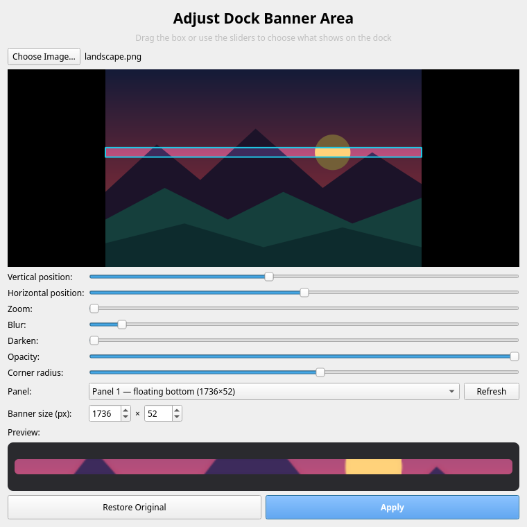

<p align="center">
  
</p>

<h1 align="center">Dock Banner</h1>

<p align="center">Put any image — sharp or blurred — on the native KDE Plasma panel.</p>

<p align="center">
  
</p>

Pick an image, drag the crop box to choose which strip of it shows up, tweak blur, darkness, opacity and
corner radius, and hit **Apply**. The banner is painted by Plasma itself, so it works with your existing
panel, floating mode, shadows and widgets — no extra docks or overlays.

Inspired by the dock banner feature of the GNOME extension *Dhruva*.

## Features

- Drag & drop images onto the window (files or straight from a browser)
- Live crop preview with a draggable box, position and zoom sliders
- Blur, darken, opacity and corner radius controls with a real-time dock preview
- Detects your panels and their real size automatically (floating, any edge, horizontal or vertical)
- Renders at 2× for crisp results on HiDPI and fractional scaling
- One click to restore your original Plasma theme

## Requirements

- KDE Plasma 6
- Python 3 with PySide6
- `qdbus6` (usually part of `qt6-tools`) for panel detection

| Distro          | Install PySide6                                                                 |
|-----------------|---------------------------------------------------------------------------------|
| Arch / Manjaro  | `sudo pacman -S pyside6`                                                        |
| Fedora          | `sudo dnf install python3-pyside6`                                              |
| openSUSE        | `sudo zypper install python3-pyside6`                                           |
| Debian / Ubuntu | `sudo apt install python3-pyside6.qtwidgets python3-pyside6.qtgui python3-pyside6.qtcore` |

## Install

```sh
git clone https://github.com/MustaphaAlioglou/kdock-banner.git
cd kdock-banner
./install.sh            # current user (~/.local)
./install.sh --system   # all users (/usr/local, uses sudo)
```

Then launch **Dock Banner** from the application menu, or run `kdock-banner`.
You can also run it without installing: `./kdock_banner.py`.

### Uninstall

```sh
./install.sh --uninstall            # or: ./install.sh --system --uninstall
```

This also switches you back to your original Plasma theme.

## Command line

```
kdock-banner [IMAGE]    open the app, optionally with an image
kdock-banner --restore  switch back to the original Plasma theme
kdock-banner --version
```

## How it works

Plasma has no setting for a panel background image, but every panel is drawn from the Plasma theme's
`widgets/panel-background` SVG. Dock Banner:

1. Copies your current Plasma theme into a new theme (`DockBanner-A` / `DockBanner-B` in
   `~/.local/share/plasma/desktoptheme`).
2. Replaces the panel frame with a 9-slice of your cropped image, sized exactly to the panel, while keeping
   the original theme's shadows and margins.
3. Applies it with `plasma-apply-desktoptheme`. The A/B names alternate so Plasma always reloads it.

Your original theme is never modified. Settings are stored in `~/.config/kdockbanner.json`.

## Notes

- The banner is made for the panel's current size. If you resize the panel, press **Apply** again.
- The theme applies to every panel, so additional panels get the same image.
- Choosing another Plasma theme in System Settings removes the banner — just apply again.

## License

[GPL-3.0-or-later](LICENSE)
